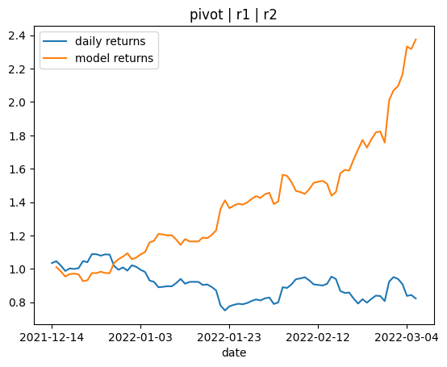

# Machine Learning Trading Bot

This project aims to train machine learning algorithms to produce profitable trading signals.

## Installation
```bash
conda create -n project_2 python=3.9.7
conda activate project_2
pip install -r requirements.txt
```

## Demo

There are two ways to train the models:

### 1. Brute force various models using Python scripts

```bash
cd /path/to/Project-2
conda activate project_2
# Train the models and save the results
python src/run_xgb.py
# Find the best models and save as a csv
python src/find_best_model.py
```

### 2. Custom model with all indicators

Open [src/trading_bot.ipynb](src/trading_bot.ipynb)

## How the models are generated

1. Pull Bitcoin daily OHLCV candlestick data from Binance api
2. Add technical indicators using `finta` and sentiment analysis
3. Set up entry/exit signals according to daily returns
4. Split the data into training and testing datasets
5. Train machine learning models using `xgboost` on various technical indicators in combinations of 3
6. Save the model as a separate file
7. Make predictions using the testing data
8. Review the classification report associated with the model predictions
9. Save the results as a separate file
10. Search for the best model after all the results are generated
11. Plot the cumulative returns of the most profitable models and save them as `.png` files

## Analysis of results
- The most profitable model used pivot, r1 and r2 (taken from the Fibonacci technical indicator) as input. It produced returns of 237% in 3 months and an accuracy of 62.7%.



- The most accurate model used 14-day RSI, r2 (Fibonacci), and s1 (Fibonacci) as input. It had an accuracy of 65.1% and produced returns of 235%.


## Areas of improvement

- Incorporating stop losses and trading fees into profit and loss calculations
- Different models such as `LSTM`, `AdaBoost`, `DecisionTreeClassifier`, or `LogisticRegression`
- Different timeframes: 4 hour, 1 hour, 15 min, 5 min etc.
- Different trading signals e.g. big sell, small sell, hold, small buy, big buy
- Different indicators and number of indicators per combination
- Dimensionality reduction such as Principle Component Analysis (PCA)
- Combine multiple models' signals into one and have majority wins

## Final Conclusions

In summary, XGBoost was used to train machine learning models which can generate profitable trading signals.
Approximately only 20% of the trained models were profitable.
About 33% of the models managed to outperform buying and holding BTC.
Thus, our models are sufficient for further investigation and validation using paper trading.
The current models can be improved by incorporating other factors such as trading fees and stop losses.
Moreover, there are multiple possibilities for future research such as using different trading signals, timeframes, models, and creating a user interface.
